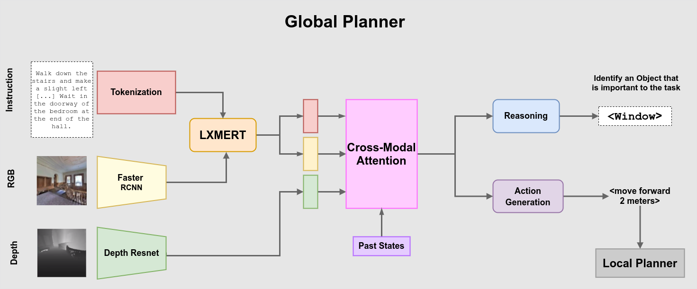

# VLN-CE Hierarchical Planner

[Paper Link](https://shaunak27.github.io/data/riss_paper.pdf) | [Poster](https://drive.google.com/file/d/1JdU1e3EpVPRZD6yjz5s5TeW5MTXyt-HU/view?usp=sharing) | [Talk](https://youtu.be/AazE5aZHgc0)

<p align="center">
    
</p>

This repo contains code for our paper <b> Reason & Act : A Modular Approach to Explanation Driven Agents for Vision and Language Navigation</b>. We introduce a modular policy in the form of a global and local planner. The global planner predicts a high-level waypoint by reasoning about the agent's environment. The local planner executes navigation to the predicted waypoint.

## Installation

Follow the instructions in [VLN-CE](https://github.com/jacobkrantz/VLN-CE)
- This code assumes that the scene data is in:
``` 
    data/datasets
    data/scene_datasets
```

## Datasets 

All datasets used are [here](https://drive.google.com/drive/folders/14w0surrcop_0s0yA3_XUgm1SgwTqEiBy).

## Models 

All models used are [here](https://drive.google.com/drive/folders/1gEzHLehaHyJYn8wX9uTc4gO4PPNtf3Zs).


## Tests 

NOTE: for all tests, the YAML file indicates the output directory where the data was saved. 

### Feature Extractor
To test the feature extractor model, run:
``` 
   cd test
   python feature_extractor.py --exp-config feature_extractor.yaml
```
Verify the models load correctly and the feature extractor successfully extracts the features from the panorama. 

### Candidate Proposal
To test the candidate proposal model, run:
``` 
   cd test
   python candidate_proposal.py --exp-config candidate_proposal.yaml
```
Verify the models load correctly and the candidate proposal generates an occupancy map and the candidate waypoints. Outputs should be generated to ``` data/out/candidate_proposal```.

### Projection Module
To test the projection module , run:
``` 
   cd test
   python backward_projection.py --exp-config backward_projection.yaml
```
Verify the models load correctly and the candidate proposal generates an occupancy map and the candidate waypoints. Outputs should be generated to ``` data/out/backward_projection```.


### Global Planner 
To test the global planner, run:
``` 
   cd test
   python global_planner.py --exp-config global_planer.yaml
```
Verify the planner generates the panoramas and predicts a heading and distance. Outputs should be generated to ``` data/out/global_planner```.
 

### Local Planner 
To test the local planner, run:
``` 
   cd test
   python local_planner.py --exp-config local_planner.yaml
```
Verify the planner generates a local path. Outputs should be generated to ``` data/out/local_planner```.

## Trainers

### Local Planner Trainer

To train or evaluate the local planner run:
``` 
   export MAGNUM_LOG=quiet
   export GLOG_minloglevel=2
   python run.py --run-type [train | eval] --exp-config vlnce_baselines/config/trainers/local_ppo.yaml
```
The YAML file specifies all the information required to train the agent (dataset and model locations, training parameters, etc...).

### Global Planner Trainer

To train or evaluate the global planner using DAgger and Seq2Seq, run:
``` 
   export MAGNUM_LOG=quiet
   export GLOG_minloglevel=2
   python run.py --run-type [train | eval] --exp-config vlnce_baselines/config/trainers/global_dagger_seq2seq.yaml
```

To train or evaluate the global planner using DAgger and CMA, run:
``` 
   export MAGNUM_LOG=quiet
   export GLOG_minloglevel=2
   python run.py --run-type [train | eval] --exp-config vlnce_baselines/config/trainers/global_dagger_cma.yaml
```
The YAML file specifies all the information required to train the agent (dataset and model locations, training parameters, etc...). 

## Citation

If you find this code useful, please consider citing our paper:

```
@techreport{halbe2021reason,
  title={Reason \& Act: A Modular Approach to Explanation Driven Agents for Vision and Language Navigation},
  author={Halbe, Shaunak and Navarro, Ingrid and Oh, Jean}
}
```

## Acknowledgements

Our code is built on top of the [VLN-CE](https://github.com/jacobkrantz/VLN-CE) and [LX-MERT](https://github.com/airsplay/lxmert) codebases. We thank the authors for making their code available.